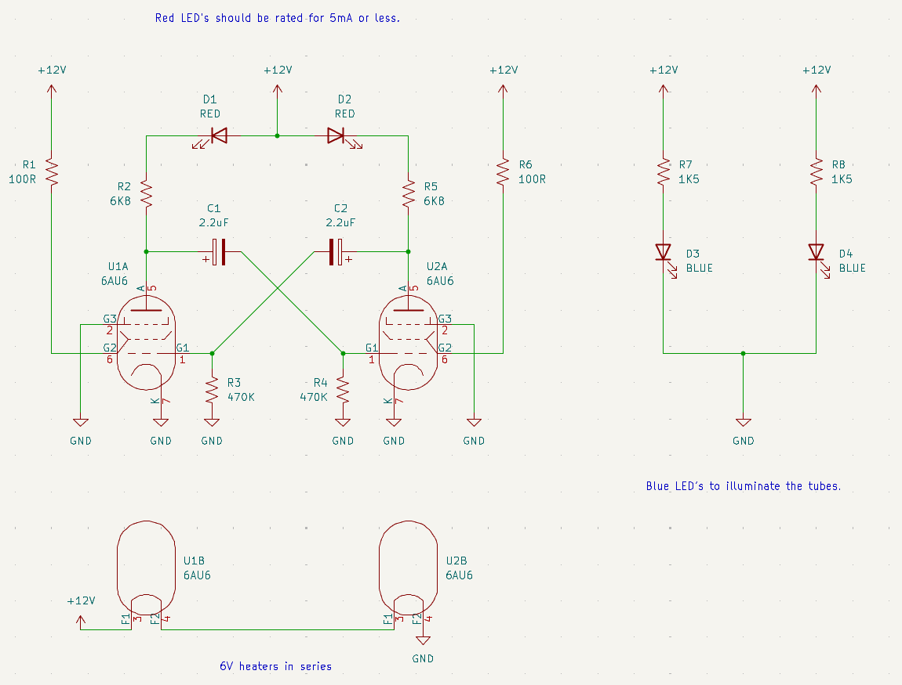

Vacuum Tube Experiments
=======================

This repository collects up a number of experiments with making
vacuum tubes do interesting things at low voltage.

Many thanks to David Lovett a.k.a Usagi Electric for showing that it
was possible to operate vacuum tubes (or "valves" as we call them in
Australia) at low voltage and get useful work out of them.

## Blinky with two 6AU6 pentodes

The simplest thing to do with vacuum tubes is blink LED's!  Henri Abraham and
Eugene Bloch invented an
<a href="https://en.wikipedia.org/wiki/Multivibrator">astable multivibrator oscillator</a>
based on two triodes during World War I.
<a href="https://ik1zyw.blogspot.com/2022/01/abraham-bloch-valve-led-multivibrator.html">The author of this blog post</a>
showed how to make a simple Abraham-Bloch blinky that could operate down to
9V using the tubes they had available.

I adapted the circuit for two 6AU6's operating at 12V with the heaters
hooked up in series to give them 6V each.  That way I only needed a single
12V supply.  I added some blue LED's mounted underneath the tubes for extra
bling, but they are optional.

Here is the schematic (click for a PDF version):

Garden variety red LED's are rated for 15mA to 20mA and will be very dimly lit
with this circuit.  I recommend using red LED's that are rated for less than
5mA, ideally 2mA or less.

The period is about one second, spending half a second on each LED during the
blink cycle.  It takes about 5-10 seconds for the tubes to warm up, during
which time the LED's act a little weird.  It eventually sorts itself out.
The circuit is very sensitive - touching the components can change the blink
rate due to the impedance of the human body!

To adjust the blink rate, easiest is to change the value of C1 and C2 to
something higher or lower.  Alternatively, change R3 and R4.  Higher values
will blink slower.

I initially prototyped the circuit on a breadboard, and then soldered
up a real one on veroboard.  Here is what the real one looks like:

## Blinky with a 6DJ8 dual triode

Can we do a blinky with one tube?  Yes we can!  The following schematic
uses a 6DJ8 dual triode (click for a PDF version):

Still runs off 12V.  I put a 27 ohm 10 watt resistor in series with the
heater to drop the heater voltage down to approximately 6V.  A high
wattage resistor is required because it will get very hot!

Here is what it looks like on a breadboard:

I played around with a number of capacitor and resistor values to
get a faster oscillator and to see what the waveform looked like.
With C1 = C2 = 100nF and R2 = R3 = 10K, I got a frequency of around 480Hz.

The signal oscillates between about 4.5V and 9.5V, measured on the anodes.

With the LED's in-circuit the frequency was roughly 1 / (1.25 * RC) where
R = R1 + R2 (16.8K in my test circuit).  With the LED removed, the
frequency was closer to the ideal of 1 / (1.38 * RC) for astable
multivibrators.  Deviation between the ideal and measured frequency
was probably due to the 5% tolerance on the resistors I was using.

## License

MIT License

## Contact

For more information on this project, to report bugs, or to suggest
improvements, please contact the author Rhys Weatherley via
[email](mailto:rhys.weatherley@gmail.com).
